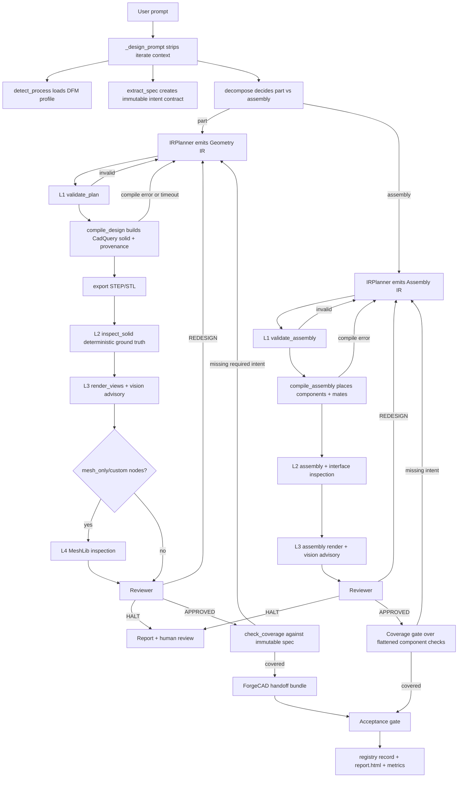

# Geometry Agent Harness — AI-Driven CAD Generation & Verification Pipeline

An **IR-centric agentic CAD pipeline** that takes a natural language prompt and autonomously designs, generates, verifies, and delivers a manufacturable 3D CAD part — with full traceability.

Instead of generating free-form CadQuery code each loop, the **Planner Agent** emits a typed, validated **Geometry IR** (a parametric feature tree in JSON) that is the single source of truth. A deterministic compiler builds the solid from the IR. Multiple verification layers (deterministic geometry checks + multimodal vision + mesh inspection) catch errors before a **Reviewer** routes `APPROVED`, `REDESIGN` (with surgical node+param fix), or `HALT`. Approved designs are handed off as an editable **ForgeCAD bundle** with a 3D viewer, parameter sliders, and live recompilation.

---

## Architecture at a Glance

```
┌─────────────────────────────────────────────────────────┐
│                    Web UI (webui/)                       │
│  Dashboard → Prompt → Watch Live → Report → 3D Editor   │
├─────────────────────────────────────────────────────────┤
│                  Product API (api/)                      │
│  POST /designs · GET /status · WS /stream · /recompile  │
├─────────────────────────────────────────────────────────┤
│              Pipeline Orchestrator (pipeline.py)         │
│  prompt → spec → decompose → plan → compile → verify    │
│         → reviewer → coverage gate → handoff            │
├──────────────────┬──────────────────┬───────────────────┤
│  Planner Agent   │ Vision Verifier  │  Reviewer Agent   │
│  (Claude→Gemini) │ (Gemini 3.1 Pro) │  (deterministic   │
│  emits IR        │  advisory L3     │   first, L2 GT)   │
├──────────────────┴──────────────────┴───────────────────┤
│           Verification Layers (verification/)            │
│  L1: schema/refs → L2: solid inspector (ground truth)   │
│  L3: multi-view render + vision → L4: MeshLib (custom)  │
├─────────────────────────────────────────────────────────┤
│           Geometry Authority (primitives/)               │
│  CadQuery canonical solids · MeshLib mesh evidence      │
├─────────────────────────────────────────────────────────┤
│          ForgeCAD Handoff (handoff/)                     │
│  ir.json + model.stl/.step + manifest.json              │
└─────────────────────────────────────────────────────────┘
```

---

## Runtime Truth — Who Owns What

| Package | Responsibility | Entry Points |
|---|---|---|
| `pipeline.py` | Orchestrator — full design→verify→handoff loop | `python pipeline.py "<prompt>"` or Docker |
| `api/` | FastAPI Product API + ForgeCAD 3D viewer | `uvicorn api.app:app --port 8000` |
| `webui/` | Browser dashboard + run page (static, no build) | served at `/ui` |
| `core/` | Provider switch, model routing, logging, LLM client, spec, env, timeouts, error translation | library |
| `core/providers.py` | **THE single provider switch-point** — swap models here | library |
| `core/compile_errors.py` | Maps 13 OCCT/CadQuery errors → human-readable repair guidance | library |
| `core/timeout.py` | `run_with_timeout()` — operation timeout wrapper (compile, render, API) | library |
| `core/spec.py` | Immutable intent contract — extracted BEFORE planner; coverage gate | library |
| `geometry_ir/` | IR contract: feature-tree grammar (Pydantic v2) + L1 validation + JSON Schema | library |
| `primitives/` | 8 typed primitives (cylinder, cone, frustum, box, hole, sphere, tube, profile) + patterns + compiler + export | library |
| `tools/` | All agent tools — planner_tools, meshlib_tools, meshlib_sandbox | registered by agents |
| `agents/planner_agent` (`IRPlanner`) | Emits Geometry IR; Claude→Gemini failover; domain skill cards | via `pipeline.py` |
| `agents/vision_agent` | L3 multimodal verifier — "Thinking with Images" (advisory only) | via `pipeline.py` |
| `agents/reviewer_agent` | Deterministic-first router + surgical node-keyed repair | via `pipeline.py` |
| `agents/meshlib_agent` | DEMOTED L4: AI mesh checks for `custom`/mesh-only nodes | via `pipeline.py` |
| `verification/` | L2 `solid_inspector` (ground truth) + L3 `renderer` + assembly inspector | library |
| `handoff/` | ForgeCAD bundle: `ir.json` + `model.stl/.step` + `manifest.json` + originals | via `pipeline.py` on APPROVED |
| `knowledge/` | CAD API and OCCT error reference modules injected into planner and tools | library |
| `knowledge_base/` | 6 manufacturing DFM profiles (FDM, SLA, SLS, CNC, Injection Molding, Casting) | library |
| `evaluation/` | Deterministic edge-case scorecard (11 cases, no LLM needed) | `python -m evaluation.run_eval` |
| `reporting/` | Per-run self-contained `report.html` with images, check tables, coverage | library |

---

## Model Routing

**Capability-based** (in `core/providers.py`). Each role LEADS with the best model family and auto-falls-back:

| Role | Primary Model | Rationale |
|---|---|---|
| **Planner** | Claude Sonnet 4 | Precise structured IR, strict schema, tool use |
| **Vision Verifier** | Gemini 3.1 Pro | Native multimodal (rendered views) |
| **Reviewer** | Gemini 3.1 Pro | Analytical reasoning (deterministic-first; LLM only narrates) |
| **Intent Extraction** | Gemini 3.1 Pro | Different family than planner — the examiner doesn't share the student's blind spots |
| **Process Detection** | Gemini 3.5 Flash | Cheap classification |
| **MeshLib Inspector** | Claude Sonnet 4 | Precise code generation with tool use |

**To swap any role's model:** change one string in `AGENT_MODELS` (in `core/providers.py`).  
**To add a new provider** (e.g., OpenAI): add one entry to `PROVIDERS`.  
**To override via environment:** set `PLANNER_MODEL`, `VISION_MODEL`, etc. in `.env`.

Every run logs a **diagnostic summary** at startup showing which providers have active keys:
```
[ENV] providers: anthropic=✓ | google=✓
```

---

## Quickstart

### Prerequisites
- Docker (recommended) OR Python 3.10+ with CadQuery + MeshLib installed locally
- At least one LLM API key (Anthropic or Google Gemini)

### 1. Create `.env`
```bash
cat > .env <<'ENV'
# At least one key is required — the other family is the automatic fallback
ANTHROPIC_API_KEY=sk-ant-...
GEMINI_API_KEY=AIza...

# Optional: override specific role models
# PLANNER_MODEL=claude-sonnet-4-20250514
# VISION_MODEL=gemini-3.1-pro-preview

# Optional: require API key for the web UI (leave unset for local dev)
# HARNESS_API_KEY=my-secret-key
ENV
```

### 2. Docker (Recommended — All Dependencies Included)
```bash
# Build
docker build -t agentic-cad-pipeline .

# Run with a custom prompt
docker run --env-file .env \
  -v "$(pwd)/outputs:/app/outputs" \
  agentic-cad-pipeline \
  python pipeline.py "Create a flange coupling with 8 bolt holes and 3mm fillets"

# Run with interactive planner Q&A
docker run -it --env-file .env \
  -v "$(pwd)/outputs:/app/outputs" \
  agentic-cad-pipeline \
  python pipeline.py --interactive "Design a CNC bracket with pocketing"

# Run with default stress-test prompt (mounting bracket)
docker run --env-file .env \
  -v "$(pwd)/outputs:/app/outputs" \
  agentic-cad-pipeline python pipeline.py
```

### 3. Local Terminal (Advanced)

This repository does not currently include a Python dependency lockfile or `requirements.txt`.
Use Docker for the reproducible runtime. Local execution is only practical if CadQuery,
MeshLib, ADK, FastAPI, and the provider SDKs are already installed in your environment.

```bash
# Optional local environment shell
python3 -m venv .venv
source .venv/bin/activate

# Run with default prompt
python pipeline.py

# Run with custom prompt
python pipeline.py "Create an SLA-friendly enclosure with 2mm walls"

# Interactive mode (planner asks clarification questions)
python pipeline.py --interactive "Create an injection-molded housing with draft angles"
```

---

## Web UI — Run Everything from a Browser

This is the primary way to use the platform. Start the server, then open the URL.

```bash
# Start the API server + Web UI
uvicorn api.app:app --port 8000 --host 0.0.0.0
```

Open **http://localhost:8000** in your browser. You'll see:

### Dashboard (`/ui/index.html`)
- Type a design prompt → click "Start Design"
- See all past runs with their status (queued → running → approved/completed/failed)
- Click any run to open its detail page

### Run Page (`/ui/run.html`)
Three tabs:

| Tab | What It Shows |
|---|---|
| **Summary** | Live pipeline log, error panel, report.html when ready, verdict |
| **3D & Edit** | Interactive 3D viewer with parameter sliders — edit dimensions and recompile live |
| **Actions** | Accept/Reject the design, or send revision feedback (Iterate) |

### What Happens When You Submit a Prompt

1. The system detects the manufacturing process (FDM, SLA, CNC, etc.)
2. An independent intent spec is extracted from your prompt (the "exam")
3. The Planner Agent asks clarifying questions if needed (layman-friendly, no jargon)
4. A validated Geometry IR is emitted and compiled to a CadQuery solid
5. Multiple verification layers check the geometry (deterministic + visual)
6. The Reviewer decides: APPROVED, REDESIGN (with specific fixes), or HALT
7. On APPROVED: ForgeCAD editable bundle + acceptance gate + registry record
8. You get a self-contained report with all evidence

---

## Product API Reference

All API endpoints (serve the Web UI or drive the pipeline programmatically):

| Method | Endpoint | Purpose |
|---|---|---|
| `POST` | `/designs` | Start a new design run → `{run_id, status_url}` |
| `GET` | `/designs` | List all runs + states |
| `GET` | `/designs/{id}/status` | State, verdict, artifacts, report_url, pending questions, Q&A history |
| `GET` | `/designs/{id}/report` | Download `report.html` (self-contained with embedded images) |
| `GET` | `/designs/{id}/log` | Tail of live pipeline execution log |
| `GET` | `/designs/{id}/artifacts/{name}` | Download any run artifact (ir.json, model.stl, model.step, manifest.json, etc.) |
| `POST` | `/designs/{id}/iterate` | Start a child run with revision feedback + full context continuity |
| `POST` | `/designs/{id}/answer` | Answer a planner question (resume blocked interactive run from browser) |
| `POST` | `/designs/{id}/approve` | Human acceptance/rejection gate — writes durable record |
| `WS` | `/ws/designs/{id}/stream` | Live status frames (WebSocket) until terminal state |
| `GET` | `/designs/{id}/viewer` | ForgeCAD 3D viewer page with parameter sliders |
| `POST` | `/recompile` | Edit IR → recompile → re-verify → return new STL + checks |

### API Usage Examples
```bash
# Start a design
curl -X POST http://localhost:8000/designs \
  -H "Content-Type: application/json" \
  -d '{"prompt": "A mounting bracket with 4 M6 holes and a stiffener rib"}'

# Check status
curl http://localhost:8000/designs/abc123/status

# Download report
curl http://localhost:8000/designs/abc123/report > report.html

# Send revision feedback
curl -X POST http://localhost:8000/designs/abc123/iterate \
  -H "Content-Type: application/json" \
  -d '{"feedback": "Make the base plate 10mm thicker"}'

# Approve the design
curl -X POST http://localhost:8000/designs/abc123/approve \
  -H "Content-Type: application/json" \
  -d '{"accepted": true, "note": "Looks good"}'
```

### Security
Set `HARNESS_API_KEY` in your `.env` to require `x-api-key` header on all requests (including the Web UI). When unset, the API is open for local development.

---

## Running Tests

Docker is the authoritative verification environment because it installs CadQuery,
MeshLib, ADK, FastAPI, and the rendering stack. The local shell may not have those
CAD dependencies, so local test collection can fail with `No module named cadquery`.

Fresh Docker verification on 2026-06-08:
`127 passed, 7 warnings in 50.92s`.

```bash
# Full verification in the recommended runtime
docker build -t agentic-cad-pipeline .
docker run --env-file .env \
  -v "$(pwd)/outputs:/app/outputs" \
  agentic-cad-pipeline \
  python -m pytest -q

# Lightweight local checks that do not require CadQuery/MeshLib
python3 -m pytest -q tests/test_compile_errors.py tests/test_env.py tests/test_spec.py
```

> The Docker image includes `pytest`; rebuild the image after source changes before
> trusting the full-suite result. Some tests may also need valid LLM API keys
> depending on the code path exercised.

---

## Evaluation Scorecard

A deterministic edge-case library (11 cases) runs through the verification spine to catch regressions:

```bash
python -m evaluation.run_eval
open evaluation/report/index.html   # view the scorecard
```

Cases include: interference, floating parts, mate cycles, missing ground, flat-vs-swept fins, wrong counts, too-thick features, missing params. **No LLM calls** — pure deterministic verification.

---

## ADK Web UI — Inspect Agent Sessions

Debug planner conversations and tool calls:

```bash
./agents/.agnts/bin/python -m google.adk.cli web \
  --session_service_uri "sqlite+aiosqlite:///outputs/adk_sessions.db" \
  --port 8080 agents

# Open http://127.0.0.1:8080
```

---

## How It Works — End-to-End Flow



```
User Prompt ("mounting bracket with a 100mm base and 4 bolt holes...")
  │
  ├─ _design_prompt() ................... strips iterate Q&A context
  ├─ detect_process() ................... FDM/SLA/CNC + DFM profile (keyword→LLM→default)
  ├─ extract_spec() ..................... IMMUTABLE intent contract (4–8 requirements)
  │     └─ fallback: regex-based dimension/count/bore/taper extraction
  ├─ decompose() ........................ part vs assembly judgment
  │
  ▼
Planner Agent (IRPlanner, Claude→Gemini)
  ├─ Asks clarifying questions (layman-friendly, batched, with "standard" fallback)
  ├─ Discovers available primitives (list_primitives + get_primitive_schema)
  ├─ Plans feature tree (base solid → unions → cuts → patterns)
  ├─ Emits validated Geometry IR
  └─ Self-corrects via validate_plan() until valid=true
  │
  ▼
┌─── Geometry IR (JSON feature tree) ──────────────────────────┐
│  { "envelope": {...}, "features": [                           │
│     {"id":"base", "type":"box", "params":{length:100,...}},   │
│     {"id":"holes", "type":"circular_pattern", ...},           │
│     {"id":"bore", "type":"hole", ...} ]}                      │
└──────────────────────────────────────────────────────────────┘
  │
  ├─ L1: validate_plan() ............... schema + reference integrity
  ├─ L1: compile_design() .............. IR → CadQuery solid + per-feature provenance
  ├─ L1: export_solid() ................ STEP + STL files
  ├─ L2: inspect_solid() ............... deterministic intent ground truth (node-keyed)
  │      single_solid · envelope(diameter/Z) · count · uniform_thickness · taper · bore
  ├─ L3: render_views() + Vision ....... advisory "Thinking with Images" (5 canonical views)
  ├─ L4: MeshLib (only custom/mesh-only nodes)
  ├─ Reviewer .......................... APPROVED / REDESIGN(node+param fix) / HALT
  │      └─ L2 is ground truth — vision can NEVER override a passing L2 check
  ├─ Coverage Gate ..................... every SPEC requirement must be met
  │      └─ Doom-loop safety valve: same req fails 2× → downgrade to "preferred"
  │
  ▼
ForgeCAD Handoff (on APPROVED)
  ├─ ir.json (editable source of truth)
  ├─ ir_original.json (immutable — "Reset to original" button)
  ├─ model.stl / model.step (preview geometry)
  ├─ model_original.stl (immutable)
  └─ manifest.json (per-node builder + provenance)
  │
  ▼
Acceptance Gate
  ├─ Human accept/reject (interactive) or auto-accept (non-interactive)
  └─ Durable record: 10_acceptance_record.json + outputs/registry.jsonl
```

**Max 6 outer iterations.** Planner sessions persist to SQLite, so `iterate()` child runs inherit full conversation history.

---

## Key Features

| Feature | What It Does |
|---|---|
| **Domain Skill Cards** | Gear, enclosure, bracket guidance injected ONLY when prompt keywords match — no gear formulas clutter a bracket prompt |
| **Layman-Friendly Q&A** | Planner asks "Should this be lightweight like a phone case or strong like a wrench?" — not "Specify min_wall_mm" |
| **OCCT Error Translation** | Cryptic C++ exceptions ("BRepAlgoAPI_Fuse") → "Features don't overlap — offset one by 1mm" |
| **Doom-Loop Safety Valve** | Same phantom spec requirement failing twice → auto-downgraded to "preferred" (prevents 6-iteration exhaustion) |
| **Operation Timeouts** | Compile (120s), render (60s), vision API (120s) — prevents hangs from blocking the pipeline |
| **Fallback Spec** | During Gemini outage, regex extracts dimensions, bores, taper, swept patterns — coverage gate remains meaningful |
| **Per-Run Metrics** | `metrics.json` records process, domain blocks, failover events, compile failures, design count, vision runs, timeouts, verdict |
| **Streak Persistence** | Doom-loop counter persisted to `coverage_streak.json` — survives crashes/restarts |
| **Granular Provider Swap** | Edit ONE file (`core/providers.py`) to change any role's model or add a new provider |
| **Deterministic-First Safety** | L2 (solid inspector) is THE ground truth. Vision is advisory. Reviewer is deterministic. LLMs narrate — never override. |

---

## Available Primitives

The planner can use these typed building blocks:

| Primitive | Type | Parameters |
|---|---|---|
| **Cylinder** | `cylinder` | radius, height, at |
| **Cone / Frustum** | `cone` or `frustum` | r_base, r_top, height, at |
| **Box** | `box` | length, width, height, at |
| **Hole** | `hole` | diameter, depth (null = through-all) |
| **Sphere** | `sphere` | radius, at |
| **Tube** | `tube` | outer_radius, inner_radius, height, at |
| **Profile** | `profile` | operation (extrude/revolve/sweep/loft), depth, sketch |
| **Circular Pattern** | `circular_pattern` | count, axis, nested feature |
| **Linear Pattern** | `linear_pattern` | count, step, nested feature |
| **Custom** | `custom` | code (CadQuery escape hatch — quarantined) |

**To add a new primitive:** add `<Name>Params` (params.py) → `build_<name>` (builders.py) → `LEAF_BUILDERS` + `FORGECAD_MAP` entries (registry.py) → unit test.

---

## Project Structure

```
.
├── pipeline.py              # Main orchestrator (setup → loop → handoff)
├── api/
│   ├── app.py               # FastAPI Product API (all endpoints)
│   ├── recompile.py         # Stateless IR edit→recompile→re-verify
│   └── viewer.py            # ForgeCAD 3D viewer + parameter sliders
├── webui/
│   ├── index.html           # Dashboard (prompt → run list)
│   ├── run.html             # Run page (live log + 3D viewer + actions)
│   └── static/              # app.js, run.js, style.css
├── agents/
│   ├── planner_agent/       # IRPlanner (emits Geometry IR, domain cards)
│   ├── vision_agent/        # L3 multimodal verifier ("Thinking with Images")
│   ├── reviewer_agent/      # Deterministic-first router (APPROVED/REDESIGN/HALT)
│   └── meshlib_agent/       # L4 demoted: AI mesh checks (custom nodes only)
├── core/
│   ├── providers.py         # THE single provider/model switch-point
│   ├── env.py               # .env bootstrap + key aliasing + diagnostic_summary
│   ├── spec.py              # Immutable intent contract + coverage gate + decompose
│   ├── compile_errors.py    # OCCT error → human-readable feedback (13 patterns)
│   ├── timeout.py           # run_with_timeout() wrapper for compile/render/API
│   ├── llm_client.py        # Direct LLM calls (non-ADK) with failover
│   ├── adk_runner.py        # Stateless ADK agent run with failover
│   ├── model_config.py      # Model resolution + ADK registry patching
│   ├── process_detector.py  # Manufacturing process + DFM profile selection
│   ├── registry.py          # Human acceptance gate + durable record
│   ├── logger.py            # Per-run file logging
│   └── _quiet.py            # Suppresses "Event loop is closed" noise
├── geometry_ir/
│   ├── models.py            # IR feature-tree grammar (Design, Feature, Envelope)
│   ├── validate.py          # L1 validation (schema + refs + param types)
│   └── assembly.py          # Assembly IR + validate_assembly
├── primitives/
│   ├── params.py            # Typed param schemas (Pydantic v2) per primitive
│   ├── builders.py          # Geometry store — CadQuery solid per primitive
│   ├── compiler.py          # IR → CadQuery solid + per-feature provenance
│   ├── assembly.py          # Mate solver + multi-body compiler
│   ├── registry.py          # LEAF_BUILDERS + FORGECAD_MAP lookup tables
│   └── export.py            # Solid → STEP / STL export
├── verification/
│   ├── solid_inspector.py   # L2 deterministic intent ground truth (node-keyed)
│   ├── renderer.py          # L3 headless multi-view PNG renderer
│   ├── assembly_inspector.py# Assembly L2 (per-component + interfaces)
│   └── interface_inspector.py # Interference/contact/concentric/fit checks
├── handoff/
│   └── forgecad_emit.py     # ForgeCAD bundle (IR + STL/STEP + manifest + originals)
├── tools/
│   ├── planner_tools.py     # list_primitives, get_primitive_schema, validate_plan, ask_user
│   ├── meshlib_tools.py     # execute_meshlib_code, explore_meshlib_api
│   └── meshlib_sandbox.py   # Subprocess sandbox + invariant baseline
├── tests/                   # Unit/integration tests; run full suite in Docker
├── evaluation/              # Deterministic edge-case scorecard (11 cases)
├── reporting/               # Per-run self-contained report.html
├── knowledge_base/
│   └── manufacturing_profiles.json  # 6 process DFM profiles
├── knowledge/
│   ├── cadquery_api/        # CadQuery API reference (80+ methods, 30 examples)
│   └── occt_errors/         # OCCT error-solution pattern DB (30+ patterns)
├── Dockerfile               # Recommended runtime container
├── explanation.md           # Full architecture + file/function reference
├── fix.md                   # Build journey: every problem, root cause, fix
└── AI_Harness_ForgeCAD_Magazine.html  # Problem statement + architecture vision
```

---

## Output Files Per Run

Each run creates `outputs/run_YYYYMMDD_HHMMSS/` (or `outputs/run_<id>/` from API):

| File | Content |
|---|---|
| `00_pipeline_execution.log` | Full pipeline log with diagnostic summary at top |
| `01_design_brief.json` | Prompt, detected process, min wall, spec |
| `01b_spec.json` | Immutable intent requirements (the "exam") |
| `01c_decomposition.json` | Part vs assembly judgment + components |
| `02_outer*_planner_output.txt` | Planner's full text response |
| `02_outer*_planner_revision.txt` | Planner's revision (REDESIGN feedback applied) |
| `03_outer*_ir.json` | The validated Geometry IR for that iteration |
| `04_outer*_model.step` | CAD model in STEP format |
| `04_outer*_model.stl` | CAD model in STL format (for 3D viewer) |
| `05_outer*_solid_inspection.json` | L2 deterministic checks (node-keyed pass/fail) |
| `06_outer*_vision_findings.json` | L3 advisory vision findings |
| `07_outer*_reviewer_verdict.json` | APPROVED / REDESIGN / HALT + reasoning + node-keyed fix |
| `08_outer*_spec_coverage.json` | Intent coverage report (every spec requirement checked) |
| `09_outer*_view_{front,side,top,iso,section}.png` | 5 canonical rendered views |
| `APPROVED_ir.json` | The final approved IR |
| `forgecad_handoff/` | Editable bundle: `ir.json`, `ir_original.json`, `model.stl`, `model.step`, `model_original.stl`, `manifest.json` |
| `10_acceptance_record.json` | Human acceptance/rejection record |
| `metrics.json` | Per-run metrics: process, domain_blocks, compile_failures, design_count, vision_runs, timeouts, verdict |
| `coverage_streak.json` | Doom-loop streak counter (persisted for crash recovery) |
| `planner_session_id.txt` | ADK session ID (for iterate context continuity) |
| `report.html` | Self-contained run report with embedded images, check tables, verdict |

---

## Troubleshooting

### "No module named cadquery" or "No module named meshlib"
Use Docker — it includes all CAD/MeshLib dependencies pre-installed. Local installation of CadQuery requires OCCT 7.6+ and is complex.

### Planner is not asking questions
- CLI: add `--interactive` flag
- Docker: also add `-it` for TTY
- Web UI: questions appear automatically in the run page

### Model/API failures (401, key errors)
- Verify `.env` keys: `ANTHROPIC_API_KEY` and/or `GEMINI_API_KEY`
- Check the diagnostic summary at the top of `00_pipeline_execution.log` — it shows which providers have active keys
- The `.env` file ALWAYS overrides terminal environment variables (`override=True` in `core/env.py`)
- Each role auto-falls back to the other provider family if its primary key is missing

### No output files on host (Docker)
- Ensure the mount is exactly: `-v "$(pwd)/outputs:/app/outputs"`

### Run exhausted all 6 attempts
- Check `01b_spec.json` for phantom requirements (abstract targets like `smooth_surfaces` get filtered, but occasionally survive)
- The doom-loop safety valve auto-downgrades stuck requirements after 2 consecutive misses — check `08_*_spec_coverage.json`
- If a legitimate requirement keeps failing, check `07_*_reviewer_verdict.json` for the node-keyed fix — it tells the planner exactly what to change

### Stale Docker image
```bash
docker build --pull --no-cache -t agentic-cad-pipeline .
```

### ADK "Event loop is closed" noise
Harmless — suppressed by `core/_quiet.py`. Real errors still surface normally.

---

## Documentation Map

| Document | Purpose |
|---|---|
| **`README.md`** (this file) | Quickstart, commands, architecture overview, API reference |
| **`explanation.md`** | Full architecture, every file/function, agent/tool wiring, phase history |
| **`explanation.txt`** | RLM memory/corpus explanation: primitive library, skill library, examples, traces |
| **`fix.md`** | Build journey — every problem encountered, root cause analysis, and fix applied |
| **`AI_Harness_ForgeCAD_Magazine.html`** | Problem statement + architecture vision (the "why") |

---

## Architecture Note

The safety core is **deterministic-first validation**: every L2 check runs without an LLM. The reviewer's verdict is computed from L2 results — vision (L3) is advisory only and can NEVER override a passing L2 check. This eliminates hallucination-driven acceptance of wrong geometry.
